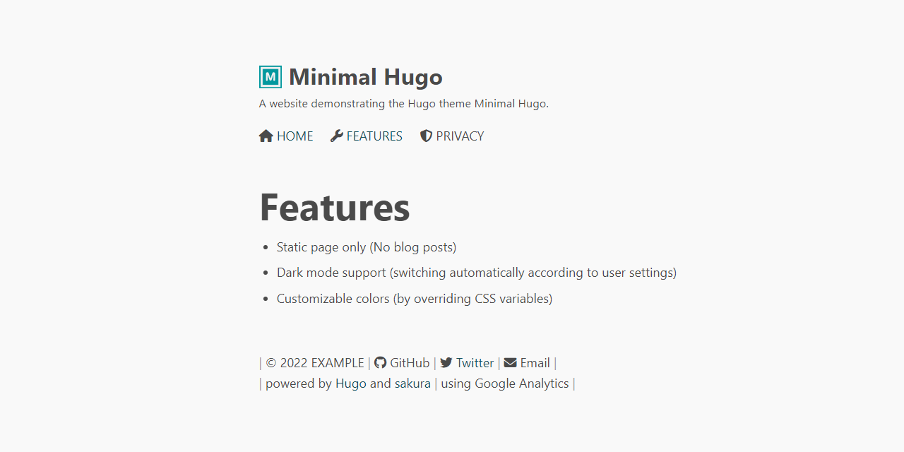

# Minimal Hugo

A minimal Hugo theme used in Higama-ya's websites.

## Features

- Static page only (No blog posts)
- Dark mode support (switching automatically according to user settings)
- Customizable colors (by overriding CSS variables)

## Examples

Minimal Hugo is used in the following Higama-ya's websites.

- [higamaya.com](https://higamaya.com/) ([Repo](https://github.com/higamaya/higamaya.com))
- [chrome-web-store.higamaya.com](https://chrome-web-store.higamaya.com/) ([Repo](https://github.com/higamaya/chrome-web-store))

The source code is published under the MIT license, so you can use it as a template.
